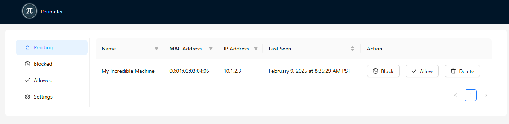

# Perimeter

<p align="center">
  
</p>

## Table of Contents

- [Description](#description)
- [Getting Started](#getting-started)
  - [Running Perimeter](#running-perimeter)
  - [Configuration](#configuration)
- [Screenshots](#screenshots)
- [Configuring UniFi Network Controller](#configuring-unifi-network-controller)
- [UniFi Hostname Sync](#unifi-hostname-sync)
- [Settings](#settings)
- [Configuration](#configuration)
- [License](#license)

---

## Description

Perimeter is a self-hosted small-scale MAC filtering management server designed to facilitate access management on a local wireless network.

Perimeter uses RADIUS to allow or block clients based on defined policies.

Additionally, Perimeter can be integrated with a UniFi Network Controller to learn about hostnames of connected devices, enhancing visibility and ease of management.

---

## Screenshots

**Dashboard View**
  

---

## Getting Started

## Configuration

Perimeter is configured using environment variables:

| Environment Variable   | Required?                        | Description                                                                         |
| ---------------------- | -------------------------------- | ----------------------------------------------------------------------------------- |
| `RADIUS_PASSWORD`      | Yes                              | Password used for RADIUS authentication                                             |
| `PERIMETER_SECRET_KEY` | In public facing deployment      | Django [Secret Key](https://docs.djangoproject.com/en/5.1/ref/settings/#secret-key) |
| `UNIFI_BASE`           | For syncing hostnames with UniFi | Base URL of the UniFi API (see [UniFi Host Sync](#unifi-host-sync))                 |
| `UNIFI_TOKEN`          | For syncing hostnames with UniFi | UniFi API key for syncing hostname data. (see [UniFi Host Sync](#unifi-host-sync))  |
| `DEBUG`                | No                               | If set to `true`, increases the log level for debugging.                            |

---

### Running Perimeter

To start Perimeter using Docker, use the following command:

```sh
docker run \
  --name=perimeter \
  -p 1812:1812/udp \
  -p 1813:1813/udp \
  -p 8001:8001 \
  -v $(pwd)/data:/app/data \
  -e RADIUS_PASSWORD=$RADIUS_PASSWORD \
  -e UNIFI_BASE=$UNIFI_BASE \
  -e UNIFI_TOKEN=$UNIFI_TOKEN \
  ghcr.io/ebirger/perimeter:latest
```

---

## Configuring UniFi Network Controller

To configure a UniFi Network Controller to send RADIUS authentication and accounting messages to the Perimeter container, follow these steps:

1. **Access the UniFi Controller**
   - Open the UniFi Network Controller web interface.

2. **Navigate to Settings**
   - Go to **Settings** → **Profiles**.

3. **Create a New RADIUS Profile**
   - Click **RADIUS** → **Create New**.
   - Configure the following settings:
     - **Authentication Server:** `<PERIMETER_CONTAINER_IP>`
     - **Authentication Port:** `1812`
     - **Shared Secret:** `<RADIUS_PASSWORD>`
     - Click **Add**
     - Enable **Accounting**
     - **Accounting Server:** `<PERIMETER_CONTAINER_IP>`
     - **Accounting Port:** `1813`
     - **Accounting Shared Secret:** `<RADIUS_PASSWORD>`
     - Click **Add**
     - (Optional) set **Interim Update Interval** to periodically refresh authentication/accounting
     - Apply Changes

4. **Apply Profile to a Wireless Network**
   - Go to **Settings** → **WiFi**
   - Select the desired SSID
   - Enable **RADIUS MAC Authentication**
   - Choose the newly created **RADIUS Profile**

5. **Test the Configuration**
   - Connect a device to the network.
   - Check **Perimeter logs** for authentication and accounting messages:

   ```sh
   docker logs -f perimeter
   ```

---

## UniFi Hostname Sync

Perimeter can be configured to poll the UniFi Network Controller to retrieve hostnames for seen MAC addresses.
If enabled by setting the needed environment variables, Perimeter will periodically request device information from the UniFi API
and use it to enhance visibility into connected clients.

#### Creating the `UNIFI_TOKEN`:
- Go to **Control Panel**
- Select **Integrations**
- Follow the **Getting Started** Guide

---

## Settings

Perimeter supports different enforcement modes for handling unknown and pending clients:

- **Trust and Verify (default) :** Allows unknown/pending clients to connect and lists them in the "pending" section.
- **Lock:** Prevents unknown/pending clients from connecting but still lists them in the "pending" section.

---

## License

This project is licensed under the MIT License. See the [LICENSE](LICENSE) file for details.
